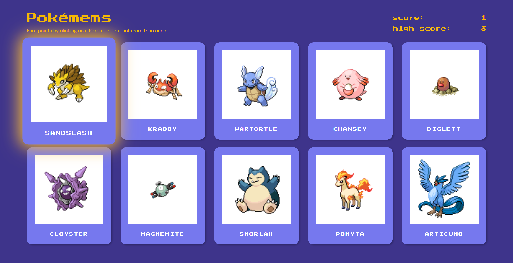

<!-- PROJECT SHIELDS -->

[![Issues][issues-shield]][issues-url]
[![MIT License][license-shield]][license-url]
[![LinkedIn][linkedin-shield]][linkedin-url]

<!-- PROJECT LOGO -->
 

  

<h3 align="center">Pokémems</h3>

  

    A fun and interactive game to test your memory featuring the original 150 Pokémon!
     
     
    <a href="https://poke-mems.netlify.app/">View demo</a>
    ·
    <a href="https://github.com/henrylin03/pokemems/issues/new">Add issue</a>
  

<!-- ABOUT THE PROJECT -->

## About

Earn points by clicking on as many unique Pokémon cards as you can. But, if you click on the same Pokémon twice, the game ends.

Challenge yourself to try and set a new high score!

This project is part of [The Odin Project's](https://www.theodinproject.com/) "Full Stack JavaScript" course. Built in ReactJS, this project focuses on practising React's `useEffect` hook for handling side effects and API calls. All Pokémon IDs, names, and images are fetched from the RESTful [PokéAPI](https://pokeapi.co/).

### Built with

<!-- CONTRIBUTING -->

## Contributing

If you have a suggestion that would make Pokémems better, please feel free to [add an issue](https://github.com/henrylin03/pokemems/issues/new) and/or fork and create a pull request.

<!-- LICENSE -->

## License

Distributed under the MIT License. See `LICENSE.txt` for more information.

## Acknowledgements

- [PokéAPI](https://pokeapi.co/) for providing the free Pokémon dataset through a RESTful API
- [Vincenzo Bianco](https://codepen.io/vinztt/pen/XjEyvZ) for the spinning Pokeball animation when a card is being loaded
- [Muhammad Jazman](https://www.iconfinder.com/icons/1703899/ball_master_pocket_pocket_monster_icon) for the static Masterball image file when a card is being loaded
- [draw.io](https://app.diagrams.net/) for its free wireframing tools
- [Coolors](https://coolors.co/) for comprehensive colour palettes
- [favicon.io](https://favicon.io) for generating the favicons
- The present README was heavily influenced by the ["Best-README-Template"](https://github.com/othneildrew/Best-README-Template)
- Markdown badges by [ileriayo](https://github.com/Ileriayo/markdown-badges)

(<a href="#readme-top">back to top</a>)

<!-- MARKDOWN LINKS & IMAGES -->

[issues-shield]: https://img.shields.io/github/issues/henrylin03/pokemems.svg?style=for-the-badge
[issues-url]: https://github.com/henrylin03/pokemems/issues
[license-shield]: https://img.shields.io/github/license/henrylin03/pokemems.svg?style=for-the-badge
[license-url]: https://github.com/henrylin03/pokemems/blob/main/LICENSE
[linkedin-shield]: https://img.shields.io/badge/-LinkedIn-black.svg?style=for-the-badge&logo=linkedin&colorB=555
[linkedin-url]: https://www.linkedin.com/in/henrylin03/
